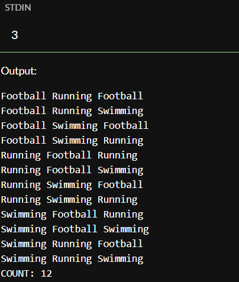

# Activity Schedules
## Task:-
### Problem Statement
Given a number of days n (1 ≤ n ≤ 10), print all possible sequences of daily activities using the set:
{"Swimming", "Running", "Football"}
subject to the constraint that no two consecutive days have the same activity.
#### Input
 * A single integer n (1 ≤ n ≤ 10).
#### Output
 * Print each valid schedule on its own line, with activities separated by a single space.
 * After listing all schedules, print a final line: COUNT: X where X is the total number of schedules generated.

## Example:-
### For n = 3;

## Expected values & Explanation:-
In every recursive step we can increase the count of possible arrangements.\
But easily we can expect the total number of them just with the following formula:\
$X(n) = 3 $\times\$ 2n-1$
